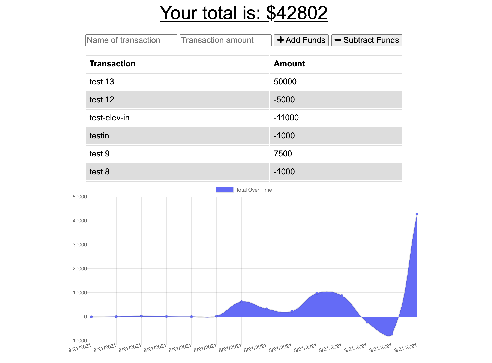

# Budget Tracker

## Table of Contents
1. [General Info](#general-info)
2. [Technologies](#technologies)
3. [Installation](#installation)
4. [Usage](#usage)
5. [Collaboration](#collaboration)
6. [Github](#github)
7. [eMail](#email)
8. [FAQs](#faqs)

# General Info
* This is a website that offers users to track their budget
* 

# Technologies
* This website was created with HTML, CSS, Javascript, Node JS, and Express on Microsoft Visual Studio Code.

# Installation
* Go to https://github.com/tnj415/budget-tracker and copy the repository on Github by clicking the green code button.
* Open your terminal, navigate to destination you want to download this repository, and run the command:
    * $ git clone https://github.com/tnj415/budget-tracker.git

# Usage
* The current version of the website can be accessed at the url: https://shrouded-falls-30365.herokuapp.com/
* This website can be navigated with the links on the website

# Collaboration
* I, Troy Johnson collaborated on this project - I used "starter-code".

# Github
* The repository can be accessed on Github at https://github.com/tnj415/budget-tracker

# eMail
* The best way to contact me is at tnj8510@gmail.com.

# Frequently Asked Questions
* There are no frequently asked questions.